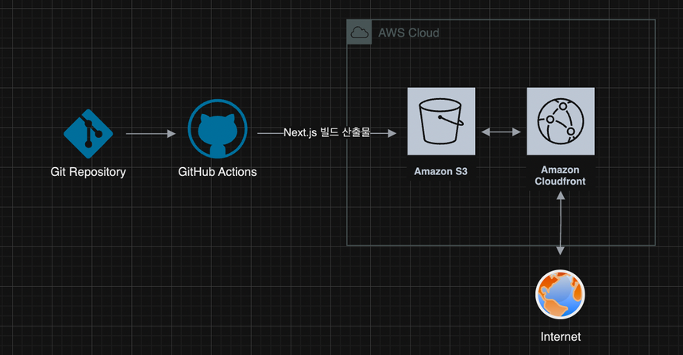

# 프론트엔드 CI/CD 파이프라인

## 개요

GitHub Actions에 워크플로우를 작성해 다음과 같이 배포가 진행되도록 함

1. 저장소를 체크아웃합니다.
2. Node.js 18.x 버전을 설정합니다.
3. 프로젝트 의존성을 설치합니다.
4. Next.js 프로젝트를 빌드합니다.
5. AWS 자격 증명을 구성합니다.
6. 빌드된 파일을 S3 버킷에 동기화합니다.
7. CloudFront 캐시를 무효화합니다.

## 주요 링크

- S3 버킷 웹사이트 엔드포인트: http://hanghae-plus-sj.s3-website.ap-northeast-3.amazonaws.com
- CloudFrount 배포 도메인 이름: https://d3t5nxqrix0yxv.cloudfront.net

## 주요 개념

- **GitHub Actions과 CI/CD 도구**: GitHub Actions는 코드 변경 시 자동으로 빌드, 테스트, 배포를 수행할 수 있는 CI/CD 도구입니다. 이를 통해 개발자는 코드 품질을 유지하고 배포 프로세스를 자동화할 수 있습니다.

- **S3와 스토리지**: Amazon S3(Simple Storage Service)는 객체 스토리지 서비스로, 데이터를 안전하게 저장하고 관리할 수 있습니다. 웹사이트 호스팅, 백업, 데이터 아카이빙 등 다양한 용도로 사용됩니다.

- **CloudFront와 CDN**: Amazon CloudFront는 콘텐츠 전송 네트워크(CDN) 서비스로, 전 세계에 분산된 서버를 통해 사용자에게 빠르게 콘텐츠를 전달합니다. 이를 통해 웹사이트의 로딩 속도를 개선하고, 사용자 경험을 향상시킬 수 있습니다.

- **캐시 무효화(Cache Invalidation)**: 캐시 무효화는 CDN에서 저장된 콘텐츠를 업데이트하거나 삭제하는 과정입니다. 새로운 콘텐츠가 배포될 때 이전 버전의 캐시를 무효화하여 사용자에게 최신 정보를 제공할 수 있습니다.

- **Repository secret과 환경변수**: Repository secret은 GitHub에서 민감한 정보를 안전하게 저장하는 방법입니다. 환경변수는 애플리케이션의 설정을 외부에서 관리할 수 있게 해주며, CI/CD 파이프라인에서 중요한 역할을 합니다.
